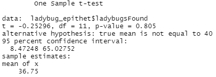

# **Ladybug_Project**

## Introduction
- We will explain the meaning of terms/column names utilized, describe the cleaning process, provide analysis, and state our conclusions for the two ladybug data sets.
---
## Data Dictionary :orange_book:
The columns that we used include:
- catalogNumber/SCAN.CODE: A code consisting of the institutionCode, collectionCode, and a unique number that is assigned to each ladybug recorded (changed to "scanCode")
- plot: the type of area in which a ladybug was located (changed to "Location")
- stateProvince: the name of a state where a sample was recorded (changed to "State")
- scientificName/Species: the scientific name of a ladybug 
- recordedBy: the name of the person who recorded the ladybug (changed to "Collectors")
- year: the year in which the sample was recorded
- specificEpithet: the specific species within a genus that makes up the second portion of the scientific name of the ladybug

The columns we created include: 
- ladyBugsFound: the number of ladybugs found
- decade: the decade in which the sample was recorded
- percentage: the proportion of a ladybug species relative to the entire collection sample for a given decade
---
## Cleaning Process :broom:
1. Changed indescript plot values to their specific meaning 
```
location_found$Location <- gsub("LP-AG-1", "Agriculture", location_found$Location) 
location_found$Location <- gsub("LP-GM-1", "Mowed Grass", location_found$Location) 
location_found$Location <- gsub("LP-GU-1", "Unmowed Grass", location_found$Location) 
location_found$Location <- gsub("LP-IC-1", "Industrial", location_found$Location) 
location_found$Location <- gsub("LP-PR-1", "Prairie", location_found$Location) 
location_found$Location <- gsub("LP-GA-1", "Garden", location_found$Location) 
location_found$Location <- gsub("LP-GF-1", "Forested", location_found$Location)
```
- This was done for plots 1-5 of each type.

2. Cleaned the species column 
- Spelling of species names was inconsistent
- Changed to abide by the actual scientific name
```
location_found$Species <- gsub("Propylea quatuordecimpuncata", "Propylea quatuordecimpunctata", location_found$Species)
location_found$Species <- gsub("hippodamia parenthesis", "Hippodamia parenthesis", location_found$Species)
location_found$Species <- gsub("hippodamia convergens", "Hippodamia convergens", location_found$Species)
location_found$Species <- gsub("Hippodamia convergence", "Hippodamia convergens", location_found$Species)
location_found$Species <- gsub("Hippodamia covergence", "Hippodamia convergens", location_found$Species)
location_found$Species <- gsub("Harmonia axyrisis", "Harmonia axyridis", location_found$Species)
location_found$Species <- gsub("harmonia axyrids", "Harmonia axyridis", location_found$Species)
location_found$Species <- gsub("harmonia axyridis", "Harmonia axyridis", location_found$Species)
location_found$Species <- gsub("Harminia axyridis", "Harmonia axyridis", location_found$Species)
location_found$Species <- gsub("Cycloneda Munda", "Cycloneda munda", location_found$Species)
location_found$Species <- gsub("cycloneda munda", "Cycloneda munda", location_found$Species)
location_found$Species <- gsub("coleomegilla maculata", "Coleomegilla maculata", location_found$Species)
location_found$Species <- gsub("Colemegilla maculata", "Coleomegilla maculata", location_found$Species)
location_found$Species <- gsub("Coccinella Septempunctata", "Coccinella septempunctata", location_found$Species)
location_found$Species <- gsub("coccinella septempunctata", "Coccinella septempunctata", location_found$Species)
location_found$Species <- gsub("Coccinella semtempuncata", "Coccinella septempunctata", location_found$Species)
```

3. Corrected grammar inconsistency for one of the species in the scientificName column 
- Incorrect capitilization created duplicate values
```
ladybug_states$scientificName <- gsub("harmonia axyridis", "Harmonia axyridis", ladybug_states$scientificName)  
augie_collectors$scientificName <- gsub("harmonia axyridis", "Harmonia axyridis", augie_collectors$scientificName) 
```
- Code shown above was used in two separate data frames

4. Cleaned the recordedBy column 
- Format and capitilization of collectors' first and last names were inconsistent
- Changed them to include their capitalized first and last names
```
collectors$recordedBy <- gsub("V. Cervantes", "Veronica Cervantes", collectors$recordedBy)
collectors$recordedBy <- gsub("Cervantes V.", "Veronica Cervantes", collectors$recordedBy)
collectors$recordedBy <- gsub("v. cervantes", "Veronica Cervantes", collectors$recordedBy)
collectors$recordedBy <- gsub("V. cervantes", "Veronica Cervantes", collectors$recordedBy)
collectors$recordedBy <- gsub("o. ruffatto", "Olivia Ruffatto", collectors$recordedBy)
collectors$recordedBy <- gsub("O. Ruffatto", "Olivia Ruffatto", collectors$recordedBy)
collectors$recordedBy <- gsub("Ruffatto O.", "Olivia Ruffatto", collectors$recordedBy)
collectors$recordedBy <- gsub("Hughes J.", "Jack Hughes", collectors$recordedBy)
collectors$recordedBy <- gsub("J. hughes", "Jack Hughes", collectors$recordedBy)
collectors$recordedBy <- gsub("j. hughes", "Jack Hughes", collectors$recordedBy)
collectors$recordedBy <- gsub("J. Hughes", "Jack Hughes", collectors$recordedBy)
collectors$recordedBy <- gsub("M. Gorsegner", "Marissa Gorsegner", collectors$recordedBy)
collectors$recordedBy <- gsub("m. Gorsegner", "Marissa Gorsegner", collectors$recordedBy)
collectors$recordedBy <- gsub("Gorsegner M.", "Marissa Gorsegner", collectors$recordedBy)
collectors$recordedBy <- gsub("m. gorsegner", "Marissa Gorsegner", collectors$recordedBy)
```

5. Renamed column names when needed or desired
- Frequently used dplyr::rename() function

6. Omitted missing/NA values
```
dplyr::filter(Species != 'UNKNOWN')
dplyr::filter(scientificName != '')
dplyr::filter(decade != "NA0s")
```
- Code shown above was used in three separate data frames
---

## Data Analysis :mag:
1. What area were the most ladybugs found in? 
- In order to create our first visualization, we started by joining the two ladybug data sets as follows:
```
joined_df <- df_scan_ladybug %>%
  dplyr::rename("SCAN.CODE" = "catalogNumber") %>%
  left_join(df_ladybug, by = c("SCAN.CODE")) %>%
```
After filtering out NA values, we selected the species and location columns and found the sum of ladybugs collected in each location. Using this data, we created the following visualization:

 <br>
- As shown in the graph, Harmonia axyridis and Coleomegilla maculata were the most commonly found ladybugs among the four Augustana students, being found in (nearly) all possible locations. 
- It is interesting to see that although quite a few ladybugs of the Brachiancantha ursina species were collected, they were only found in forested regions. 
- The greatest number of ladybugs were found in unmowed grass areas.
- We found this graph to be insightful because it illustrates that Harmonia axyridis ladybugs were the most commonly found species in almost half of the regions, along with the largest total overall. This is particularly interesting because this species is not native nor has it beeen around as long as other species, a topic which will be discussed in more depth later on.

2. What state were most of the ladybugs found in?
- To enable comparison of the number of ladybugs found in Illinois versus Iowa, we used the following code:
```
ladybug_states <- df_scan_ladybug %>%
  dplyr::filter((stateProvince == "Illinois") | (stateProvince == "Iowa")) %>%
  dplyr::select(scientificName, stateProvince) %>%
  dplyr::filter(scientificName != '') %>%
  count(scientificName, stateProvince) %>%
```
Our visualization for this data is shown below:

 <br>
- This graph shows that the majority of the 407 ladybugs found (~62%) according to the parameters specified in the code were collected in Scott County, Iowa.
- The total number of Brachiacantha ursina found is nearly identical to the last visualization, which led us to conclude that ladybugs found in forested regions were almost entirely found in Iowa as opposed to Illinois.
- Once again, Harmonia axyridis is shown to be the most dominant species in terms of the number found.

3. Did each member of the Augustana Biology department collect a similar number of each type of ladybug?
- After cleaning the joined data frame to avoid repeats due to inconsistent formatting, we used the following code to identify how many ladybugs the members of the Augustana Biology department collected from each species.
```
augie_collectors <- collectors %>%
  dplyr::filter((recordedBy == "Veronica Cervantes") | (recordedBy == "Olivia Ruffatto") | (recordedBy == "Jack Hughes") | (recordedBy == "Marissa Gorsegner")) %>%
  dplyr::select(scientificName, recordedBy) %>%
  dplyr::filter(scientificName != '') %>%
  count(scientificName, recordedBy) %>%
```
The following visualization illustrates this data:

 <br>
Out of the 453 samples collected by the members of the Augustana Biology department, each person collected a relatively similar amount:
- Jack Hughes - 113
- Marissa Gorsegner - 104
- Olivia Ruffatto - 123
- Veronica - 113

Each collector found (almost) all of the listed ladybug species and there was typically little variance in the number of ladybugs collected for a certain species from student to student. <br/>

4. How has the makeup of ladybug species distribution changed since the beginning of the project in the 1960s?
- We used the following code to allow us to graph the number of ladybugs found for each of the selected species since this project was started.
``` 
ladybug_decade$decade <- substr(ladybug_decade$year, 1, 3)
ladybug_decade$decade <- paste0(ladybug_decade$decade, "0s")
ladybug_by_decade <- ladybug_decade %>%
  dplyr::group_by(decade, scientificName) %>%
  dplyr::filter(decade != "NA0s") %>%
  dplyr::summarise(ladybugsFound = n()) %>%
  mutate(percentage = ladybugsFound / sum(ladybugsFound))
```
Note: For this visualization, we used six of the most commonly found species over the last several decades.
<br/>
This data is visualized below:

 <br>
The total number of ladybugs collected in each decade is as follows:
- 1960s - 12
- 1970s - 27
- 1980s - 35
- 1990s - 22
- 2000s - 3
- 2010s - 3
- 2020s - 294 
<br>
The sample sizes in the decades leading up to the 2020s--the 2000s and 2010s especially--are not substantial enough to    draw solid conclusions. <br/>
<br>
Values shown on the line chart for the 2000s and 2010s are not represenative of the actual distribution of species for the reason listed above, so those dramatic shifts in trends should be ignored. <br/>
<br>
However, we found this graph insightful because it shows how rapidly the Harmonia axyridis grew to be the most dominant species on the Illinois-Iowa border. We believe this trend began during the 2000s and/or the 2010s, but there was not enough data to substantiate or deny this hypothesis. <br/>
<br>
The reduced proportion of native ladybug species relative to the entire sample set, not including Coleomegilla maculata, led us to conclude that Harmonia axyridis ladybugs are outcompeting the other species for food and resources. <br/>
<br>

5. What was the average number of ladybus found per specific epithet? 
- The code used prior to conducting the t-test was written as follows:
```
ladybug_epithet <- joined_df %>%
  dplyr::filter(Species != 'UNKNOWN') %>%
  dplyr::select(specificEpithet) %>%
  dplyr::filter(specificEpithet != '') %>%
  count(specificEpithet) %>%
```
The results of our t-test are shown below:

 <br>
- Null hypothesis: The average number of ladybugs collected for each epithet is  equal to 40.
- Alternative hypothesis: The average number of ladybugs collected per epithet is not equal to 40.
- Conclusion: Because the p-value of our test (0.805) is greater than the significant threshold, we fail to reject the null hypothesis of the test. Thus, there is insufficient evidence to conclude that the mean of ladybugs found per epithet is different from 40 ladybugs.
---

## Conclusion :lady_beetle:
1. Harmonia axyridis have overtaken Coleomegilla maculata as the most dominant species of ladybug near Augustana College in recent years.
2. More ladybugs live/can be found in unmowed grass habitats than other areas, i.e., agricultural, garden, industrial, etc.
3. The greatest number of ladybug samples were collected in Scott County, Iowa.
4. All members of the Augustana Biology department collected a large and diverse sample of ladybugs in 2021.
5. Harmonia axyridis ladybugs are outcompeting other ladybug species for food and resources.


